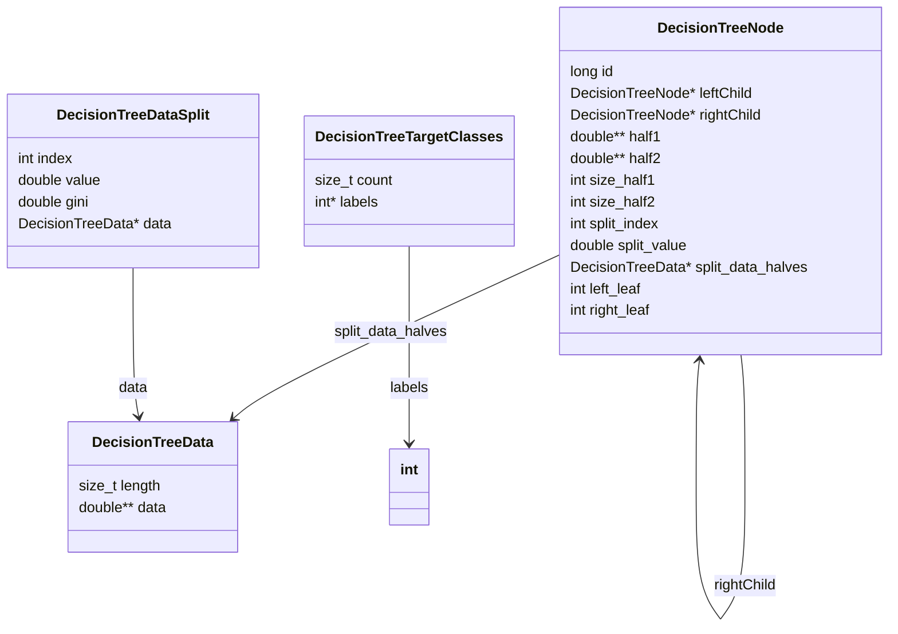

[](https://github.com/SermetPekin/random-forests-c/actions/workflows/c-cpp.yml)
# Random Forests - C
A proof of concept basic implementation of random forests for classification and accompanying decision trees in C.

---

## Key Improvements over  [https://github.com/ad8cf8/random-forests-c](https://github.com/ad8cf8/random-forests-c)

- Added real-world and synthetic dataset scripts (`data.py`, `data2.py`, `data_binary.py`) for easy experimentation.
- Fixed a data leakage bug in cross-validation logic, ensuring proper model evaluation.
- Created a cross-platform `Makefile` for simple building and testing without CMake.
- Added a GitHub Actions workflow for automated build and test on every push/PR.
- Added a Mermaid class diagram to visually explain the DecisionTreeNode and related data structures, making the library's architecture easier to understand.


These improvements enhance reproducibility, reliability, and usability for new users and contributors.

---

## Running the code

Fastest way to start experimenting is to
- (1) run the `data.py` script to generate some random CSV data
- (2) compile as preferred (optionally using the `CMakeLists.txt` provided)
- (3) run `./random-forests data.csv` or `./random-forests --help` to see which arguments are available to configure.

The [`main.c`](./main.c) file contains an example configuration of a random forest and code to run `cross_validate()` which will both train and evaluate a model.

### Training

The `cross_validate()` function runs k-fold cross validation on whatever data is provided -- first trains the model and then evaluates it on every of the testing folds.

The main function that handles model training is `train_model()`
```c
const DecisionTreeNode **train_model(double **data,
                                     const RandomForestParameters *params,
                                     const struct dim *csv_dim,
                                     const ModelContext *ctx);
```
It returns an array of `DecisionTreeNode` pointers to roots of decision trees comprising the forest, and the parameters are

- `**training_data` - training data (equivalent to a DataFrame in Python).
- `*params` - pointer to struct that holds the configuration of a random forest model.
- `*csv_dim` - pointer to a struct holding row x col dimensions of the read data.
- `*ctx` - pointer to a context object that holds some optional data that can be used for training / evaluation.

For example:
```c
const ModelContext ctx = (ModelContext){
    testingFoldIdx : foldIdx /* Fold to use for evaluation. */,
    rowsPerFold : csv_dim->rows / k_folds /* Number of rows per fold. */
};

const DecisionTreeNode **random_forest = (const DecisionTreeNode **)train_model(
    data,
    params,
    csv_dim,
    &ctx);
```

### Evaluation

After training we can evaluate the model with `eval_model()` which returns an accuracy measure for model performance.
For example:

```c
// Evaluate the model that was just trained. We use the fold identified by 'foldIdx' in 'ctx' to evaluate the model.
double accuracy = eval_model(
    random_forest /* Model to evaluate. */,
    data,
    params,
    csv_dim,
    &ctx);
```

## Code structure

- `model` -- random forest and decision trees.
- `eval` -- evaluation code for running `cross_validate()` or `hyperparameter_search()` to test the model.
- `utils` -- utilities for data management, argument parsing, etc.

The optional arguments to the program (can be viewed by running with a `--help` flag)
```
  -c, --num_cols=number      Optional number of cols in the input CSV_FILE, if
                             known
  -r, --num_rows=number      Optional number of rows in the input CSV_FILE, if
                             known
  -l, --log_level=number     Optional debug logging level [0-3]. Level 0 is no
                             output, 3 is most verbose. Defaults to 1.
  -s, --seed=number          Optional random number seed.
```

## 🛠️ Installation & Quick Start

### Option 1: Using Makefile (Recommended)

1. Ensure you have `gcc` and `make` installed.
2. Clone the repository:
   ```sh
   git clone https://github.com/SermetPekin/random-forests-c.git
   cd random-forests-c
   ```
3. Build the project:
   ```sh
   make
   ```
4. (Optional) Run the included tests:
   ```sh
   make test
   ```

### Option 2: One-Line GCC Build

If you have GCC but not Make, you can build the project with a single command:

```sh
gcc -std=c99 -O1 -o random-forest main.c utils/utils.c utils/data.c utils/argparse.c model/tree.c model/forest.c eval/eval.c
```
# with random data 
Then run:
```sh
./random-forest data.csv
```
```
using:
  verbose log level: 1
  rows: 100, cols: 100
reading from csv file:
  "data.csv"
using:
  k_folds: 5
using RandomForestParameters:
  n_estimators: 3
  max_depth: 7
  min_samples_leaf: 3
  max_features: 3
cross validation accuracy: 54.000000% (54%)
(time taken: 0.178000s)
```

---

# with scikit-learn iris data (Real data example)

```sh
./random-forest iris_binary.csv
```

```plaintext
using:
  verbose log level: 1
  rows: 100, cols: 5
reading from csv file:
  "iris_binary.csv"
using:
  k_folds: 5
using RandomForestParameters:
  n_estimators: 3
  max_depth: 7
  min_samples_leaf: 3
  max_features: 3
cross validation accuracy: 94.000000% (94%)
(time taken: 0.082000s)

```

# with scikit-learn make_classification (structured data) 
```sh
./random-forest data_binary.csv
```


```plaintext
using:
  verbose log level: 1
  rows: 150, cols: 5
reading from csv file:
  "data_binary.csv"
using:
  k_folds: 5
using RandomForestParameters:
  n_estimators: 3
  max_depth: 7
  min_samples_leaf: 3
  max_features: 3
cross validation accuracy: 90.666667% (90%)
(time taken: 0.299000s)

```
